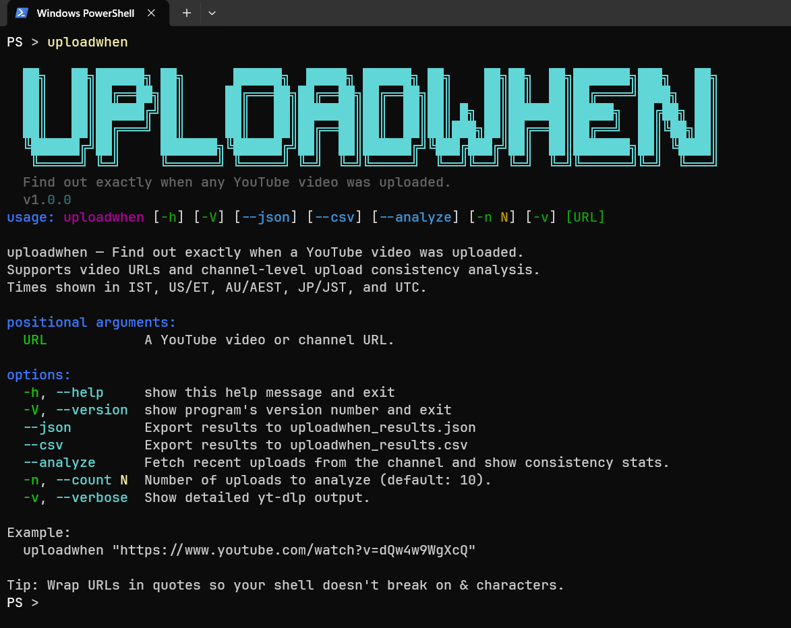
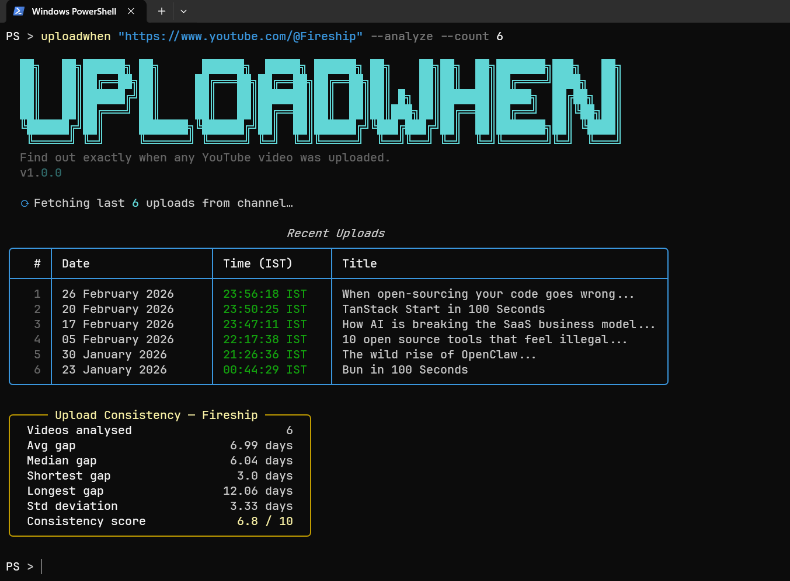
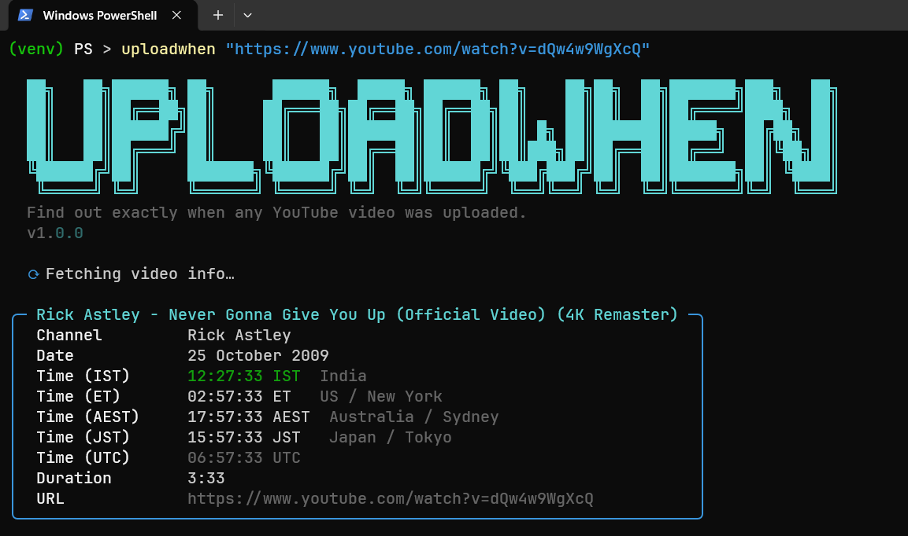

# uploadwhen

> Find out **exactly** when a YouTube video was uploaded — date & time across multiple time zones.

A Python CLI tool that extracts exact upload timestamps from YouTube videos, converts them to **IST, US/ET, AU/AEST, JP/JST, and UTC** (24-hour format). Also computes **upload consistency analytics** for any channel.

Built with [yt-dlp](https://github.com/yt-dlp/yt-dlp) and [rich](https://github.com/Textualize/rich).

---

<div align="center">
  <h3> Screenshots</h3>
  <table border="1">
    <tr>
      <td align="center">
        
        <br>
        <i>Quick Usage</i>
      </td>
    </tr>
    <tr>
      <td align="center">
        
        <br>
        <i>Consistency Analytics</i>
      </td>
    </tr>
    <tr>
      <td align="center">
        
        <br>
        <i>Multi-timezone info</i>
      </td>
    </tr>
  </table>
</div>

---

## Installation

```bash
pip install uploadwhen
```

## Quick Start

```bash
uploadwhen "https://www.youtube.com/watch?v=dQw4w9WgXcQ"
```

## Usage

```
uploadwhen [URL] [OPTIONS]
```

### Options

| Flag | Short | Description |
|---|---|---|
| `--version` | `-V` | Show version |
| `--help` | `-h` | Show help |
| `--json` | | Export results to `uploadwhen_results.json` |
| `--csv` | | Export results to `uploadwhen_results.csv` |
| `--analyze` | | Fetch recent uploads and show consistency stats |
| `--count N` | `-n N` | Number of uploads to analyze (default: 10) |
| `--verbose` | `-v` | Show detailed yt-dlp output |

### Examples

```bash
# Single video — shows upload date & time
uploadwhen "https://www.youtube.com/watch?v=dQw4w9WgXcQ"

# Analyze a channel's upload consistency (last 10 videos)
uploadwhen "https://www.youtube.com/@theRadBrad" --analyze

# Analyze last 25 uploads from a channel
uploadwhen "https://www.youtube.com/@tseries" --analyze --count 25

# Auto-detect channel from a video URL
uploadwhen "https://www.youtube.com/watch?v=dQw4w9WgXcQ" --analyze

# Export to JSON and CSV
uploadwhen "https://www.youtube.com/watch?v=dQw4w9WgXcQ" --json --csv
```

## Time Zones

| Zone | Region |
|---|---|
| **IST** | India / Asia/Kolkata (UTC+05:30) |
| **ET** | US / New York (DST-aware) |
| **AEST** | Australia / Sydney (DST-aware) |
| **JST** | Japan / Tokyo (UTC+09:00) |
| **UTC** | Reference time |

## Upload Consistency Analytics

The `--analyze` flag fetches recent uploads and computes:

| Metric | Description |
|---|---|
| Avg gap | Average time between uploads |
| Median gap | Middle value of all gaps |
| Shortest / Longest gap | Extremes |
| Std deviation | How much upload timing varies |
| Consistency score (0–10) | Higher = more regular uploads |

Gaps under 1 day are shown in hours for clarity.

Use `--count N` to analyze more or fewer videos:

```bash
uploadwhen "https://www.youtube.com/@channel" --analyze --count 50
```

## Requirements

- Python ≥ 3.9
- [yt-dlp](https://github.com/yt-dlp/yt-dlp)
- [rich](https://github.com/Textualize/rich)

## License

MIT
